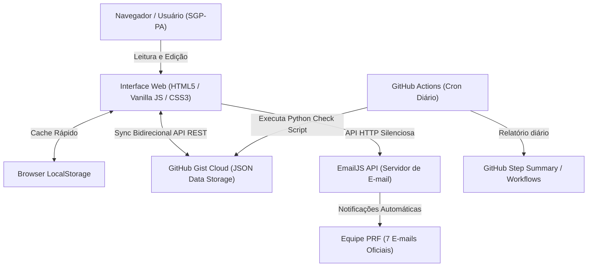
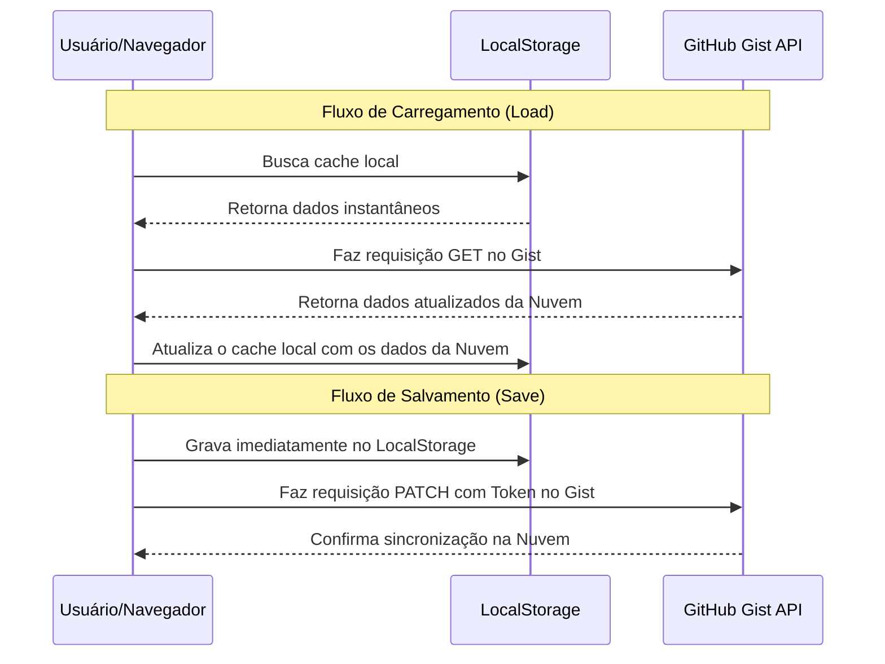

# 📘 Documentação Geral do Sistema — Painel SGP-PA PRF

> **Central de Gestão, Procedimentos Operacionais (POPs), Prazos e Processos SEI**  
> **Unidade**: Superintendência da Polícia Rodoviária Federal no Pará (SGP/NUAP-PA)  
> **Domínio/Endereço**: [sgppaprocedimentos.com.br](https://sgppaprocedimentos.com.br/)  
> **Repositório**: [GitHub — MundoInvertido/painel-siape](https://github.com/MundoInvertido/painel-siape)

---

## 📋 Sumário
1. [Visão Geral e Objetivos](#1-visão-geral-e-objetivos)
2. [Arquitetura e Tecnologias Utilizadas](#2-arquitetura-e-tecnologias-utilizadas)
3. [Módulos e Páginas do Sistema](#3-módulos-e-páginas-do-sistema)
   - [3.1 Procedimentos Operacionais (POPs) — `index.html`](#31-procedimentos-operacionais-pops--indexhtml)
   - [3.2 Gestão de Prazos e Agendamentos — `prazos.html`](#32-gestão-de-prazos-e-agendamentos--prazoshtml)
   - [3.3 Kanban de Processos SEI — `processos.html`](#33-kanban-de-processos-sei--processoshtml)
   - [3.4 Biblioteca de Comandos Espanso — `comandos.html`](#34-biblioteca-de-comandos-espanso--comandoshtml)
   - [3.5 Central de Links Úteis — `links.html`](#35-central-de-links-úteis--linkshtml)
   - [3.6 Hub de Aplicações Utilitárias — `apps.html`](#36-hub-de-aplicações-utilitárias--appshtml)
4. [Sistema de Notificação por E-mail em 2º Plano (EmailJS)](#4-sistema-de-notificação-por-e-mail-em-2º-plano-emailjs)
5. [Automação 24/7 com GitHub Actions](#5-automação-247-com-github-actions)
6. [Mecanismo Global de Cópia com 1-Clique (`copyText`)](#6-mecanismo-global-de-cópia-com-1-clique-copytext)
7. [Autenticação e Permissões de Administrador](#7-autenticação-e-permissões-de-administrador)
8. [Persistência de Dados e Sincronização em Nuvem](#8-persistência-de-dados-e-sincronização-em-nuvem)
9. [Guia de Manutenção e Deploy](#9-guia-de-manutenção-e-deploy)

---

## 1. Visão Geral e Objetivos

O **Painel SGP-PA PRF** foi desenvolvido para centralizar, otimizar e padronizar o trabalho administrativo da Seção de Gestão de Pessoas (SGP) e Núcleo de Administração de Pessoal (NUAP) da PRF no Pará.

### Principais Objetivos Alcançados:
* **Padronização de Procedimentos (POPs)**: Guias passo a passo interativos com suporte a imagens, formatação rica e códigos copiáveis.
* **Controle Estrito de Prazos Críticos**: Alertas visuais e disparos automáticos por e-mail para evitar o vencimento de processos e agendamentos.
* **Acompanhamento Visual de Processos SEI**: Quadro Kanban dinâmico para acompanhamento de tramitação de processos administrativos.
* **Produtividade Aumentada**: Coleção de comandos e atalhos configurados para expansão de texto (Espanso), links rápidos e calculadoras institucionais.

---

## 2. Arquitetura e Tecnologias Utilizadas



* **Frontend**: HTML5 Semântico, CSS3 Moderno (Glassmorphism, CSS Grid, Flexbox, Animações e Transições suaves), JavaScript ES6+ assíncrono nativo.
* **Ícones & Fontes**: FontAwesome 6, Google Fonts (Inter / Roboto).
* **Nuvem & Armazenamento**: GitHub Gist API (armazenamento de dados em nuvem sem necessidade de banco de dados SQL pesado).
* **Serviço de Notificação de E-mail**: EmailJS SDK (`@emailjs/browser`).
* **CI/CD & Automação**: GitHub Actions com scripts em Python 3.

---

## 3. Módulos e Páginas do Sistema

### 3.1 Procedimentos Operacionais (POPs) — `index.html`
* **Descrição**: Página principal contendo a base de conhecimento e procedimentos operacionais padronizados.
* **Recursos Principais**:
  * **Barra de Pesquisa em Tempo Real**: Filtra instantaneamente por título, tag, categoria ou trecho do conteúdo.
  * **Leitor em Drawer Lateral / Modal**: Exibe o procedimento formatado com suporte a passos numerados e sub-etapas.
  * **Editor de Procedimentos Visual (WYSIWYG / Código Markdown)**:
    * Alternância em tempo real entre *Modo Código (Markdown)* e *Modo Visual (Previsualização)*.
    * Suporte a formatação rica (Negrito, Itálico, Listas com recuo apropriado `1.75rem`, Tabelas, Imagens via upload/URL).
    * Botão de inserção rápida de imagens que gera dados em Base64 ou armazena URLs diretamente no Markdown.
  * **Blocos de Código Copiáveis**: Elementos `code` formatados com estilos visuais e atalho para cópia instantânea ao clicar.
  * **Gerenciamento Administrador**: Criação, edição e exclusão de procedimentos com salvamento na Nuvem (Gist) e Local.

### 3.2 Gestão de Prazos e Agendamentos — `prazos.html`
* **Descrição**: Módulo para controle de datas limites de requerimentos, pensões, substituições, licenças e pendências com prazo determinado.
* **Recursos Principais**:
  * **Tabela Dinâmica de Agendamentos**: Exibe número do processo/requerimento, servidor, assunto, data limite e status do prazo.
  * **Cálculo de Status em Tempo Real**:
    * 🔴 **Crítico** ($\le 3$ dias para vencer): destaque em vermelho com animação de alerta.
    * 🟡 **Atenção** ($4$ a $7$ dias): destaque amarelado.
    * 🟢 **Normal** ($> 7$ dias): destaque verde.
    * 🛑 **Vencido**: identificação de prazo extrapolado.
  * **Banner de Alertas no Topo**: Exibe um resumo dinâmico da quantidade de itens em estado crítico.
  * **Disparo de Notificações Por E-mail**: Envio de resumos dos prazos críticos diretamente para a equipe (via EmailJS ou cliente nativo).

### 3.3 Kanban de Processos SEI — `processos.html`
* **Descrição**: Quadro de gestão visual Kanban para monitorar a tramitação de processos no Sistema Eletrônico de Informações (SEI).
* **Recursos Principais**:
  * **Colunas de Tramitação**: Fluxo customizável (Ex: *A Analisar*, *Em Análise*, *Aguardando Documento*, *Concluído*).
  * **Cartões de Processos SEI**: Cada cartão possui Número SEI, Título/Assunto, Categoria (Tag), Responsável (SGP/NUAP), Prazo SEI e Descrição.
  * **Funcionalidade Drag & Drop**: Movimentação simples de cartões entre colunas.
  * **Filtros e Busca**: Pesquisa por número SEI, assunto ou responsável.
  * **Alerta Automático de Prazo SEI**: Notificação automática instantânea quando um novo processo com data limite é adicionado ao Kanban.

### 3.4 Biblioteca de Comandos Espanso — `comandos.html`
* **Descrição**: Acervo de atalhos e trechos de texto configurados para automação via software Espanso (arquivos YAML).
* **Recursos Principais**:
  * **Categorização de Comandos**: Organizados por temas (SGP, NUAP, Benefícios, Frequência, Aposentadoria, etc.).
  * **Leitura de Arquivos YAML**: Integração com `base.yml` e `base2.yml`.
  * **Cópia Instantânea de Gatilhos e Substituições**: Botões dedicados para copiar o código do atalho ou o texto completo formatado.
  * **Gerenciador de Comandos**: Adição e edição de novos atalhos com sincronização Gist.

### 3.5 Central de Links Úteis — `links.html`
* **Descrição**: Painel com os principais sistemas e links corporativos utilizados no dia a dia da PRF.
* **Recursos Principais**:
  * Organizado em cards categorizados (Sistemas PRF, SEI, Governo Federal, SIAPE, SGP, etc.).
  * Presente no menu lateral de **todas as 6 páginas principais** do sistema.

### 3.6 Hub de Aplicações Utilitárias — `apps.html`
* **Descrição**: Central de atalhos para ferramentas administrativas especializadas.
* **Ferramentas Incluídas**:
  * `calculadora.html` & `calculadora_substituicao_aprimorada.html`: Cálculo de pagamentos de substituição de função de chefia.
  * `contador_de_dias.html`: Calculadora de contagem de dias úteis, dias corridos e prazos administrativos.
  * `periculosidade.html`: Calculadora e consulta de adicionais de periculosidade.

---

## 4. Sistema de Notificação por E-mail em 2º Plano (EmailJS)

Para contornar a ausência ou bloqueios de clientes de e-mail locais (como Outlook), o sistema utiliza a **API do EmailJS** para disparar e-mails diretamente do navegador em segundo plano.

### 🛠️ Credenciais da Integração EmailJS:
* **Service ID**: `service_4h4ldod`
* **Template ID**: `template_o3or23l`
* **Public Key**: `MTguD2oyiG7jRcbM4`

### 📧 Lista de Destinatários Oficiais Cadastrados (7 E-mails PRF):
1. `ana.silva@prf.gov.br`
2. `gustavo.aquino@prf.gov.br`
3. `sgp.pa@prf.gov.br`
4. `nuap.pa@prf.gov.br`
5. `nathanael.lacerda@prf.gov.br`
6. `rafael.guimaraes@prf.gov.br`
7. `silvana.socorro@prf.gov.br`

### ⚡ Regras dos Gatilhos Automáticos:
1. **Cadastro/Edição de Processo SEI com Prazo (`processos.html`)**:
   Ao salvar um cartão preenchendo a *Data Limite*, o sistema dispara imediatamente uma notificação por e-mail com os detalhes do processo para toda a equipe.
2. **Cadastro/Edição de Prazos Críticos (`prazos.html`)**:
   Ao incluir ou editar um prazo cujo vencimento seja $\le 3$ dias, a notificação é disparada no ato do salvamento.
3. **Varredura Diária Automática ao Abrir a Página**:
   Ao carregar `prazos.html` ou `processos.html`, o sistema checa o `localStorage` (`last_auto_notify_prazos_date` e `last_auto_notify_processos_date`). Se houver itens críticos que ainda não foram notificados no dia de hoje, o envio é realizado automaticamente.
4. **Mecanismo de Fallback**:
   Caso o EmailJS fique inacessível por problema de rede, o sistema executa um fallback transparente utilizando o protocolo `mailto:` para acionar o e-mail nativo.

---

## 5. Automação 24/7 com GitHub Actions

O sistema conta com um fluxo de automação que roda diariamente na nuvem do GitHub, sem necessitar que nenhum usuário esteja com o computador ligado.

* **Arquivo de Workflow**: `.github/workflows/daily-deadline-email.yml`
* **Frequência**: Diariamente às 08:00 AM (Horário de Brasília) / 11:00 UTC.
* **Script de Execução**: `.github/scripts/check_deadlines.py`
* **Funcionamento**:
  1. O script Python consulta a API pública do GitHub Gist (`5bd8f241cdc0e04c683bc580bd379c45`).
  2. Analisa todos os prazos cadastrados e calcula a diferença de dias.
  3. Filtra itens com `diff_days <= 3`.
  4. Gera um **GitHub Step Summary** detalhado na aba Actions do repositório com o status formatado dos prazos da SGP-PA.

---

## 6. Mecanismo Global de Cópia com 1-Clique (`copyText`)

Para garantir facilidade na cópia de textos, códigos e números de processos:

* **Função Global**: `copyText(text)` disponível em todas as páginas.
* **Mecanismo Primário**: Usa `navigator.clipboard.writeText(text)`.
* **Mecanismo de Fallback**: Cria um `textarea` temporário e usa `document.execCommand('copy')` para compatibilidade com navegadores legados ou contextos não seguros.
* **Interatividade Visual**:
  * Todos os elementos `code` e `.code-copy` possuem cursor `pointer`, efeito hover e indicação tátil.
  * O texto entre crases (`` `código` ``) no Markdown é renderizado automaticamente como código clicável.
  * Ao clicar, é exibido um aviso instantâneo (*Toast notification*) informando que o conteúdo foi copiado.

---

## 7. Autenticação e Permissões de Administrador

Para proteger os dados e impedir edições acidentais por visitantes não autorizados:

* **Papeis de Usuário**:
  * **Visitante / Leitor**: Pode buscar, visualizar procedimentos, filtrar prazos, copiar comandos e acessar links.
  * **Administrador**: Pode criar, editar e excluir procedimentos, prazos e processos SEI.
* **Usuários Administradores Autorizados**:
  * `nathanaeladmin@gmail.com`
  * `nuap.pa@prf.gov.br`
  * `sgp.pa@prf.gov.br`
* **Segurança de Autenticação**: Validação via hash SHA-256 da senha digitada no modal de login, gravando a sessão no `localStorage` (`admin_session = true`).

---

## 8. Persistência de Dados e Sincronização em Nuvem



* **ID do Gist Principal**: `5bd8f241cdc0e04c683bc580bd379c45`
* **Backup e Restauração**: Opção de exportar todos os procedimentos e prazos em formato `.json` nas configurações da página.

---

## 9. Guia de Manutenção e Deploy

### Como publicar alterações:
O site está hospedado via **GitHub Pages** diretamente do repositório `MundoInvertido/painel-siape` na branch `main`.

Para salvar e publicar edições feitas no código:
```bash
git add .
git commit -m "descricao das melhorias"
git push origin main
```

Após o `git push`, as alterações estarão disponíveis publicamente em [sgppaprocedimentos.com.br](https://sgppaprocedimentos.com.br/) em poucos segundos.

---
*Documentação gerada e atualizada para a equipe SGP/NUAP-PA PRF.*
